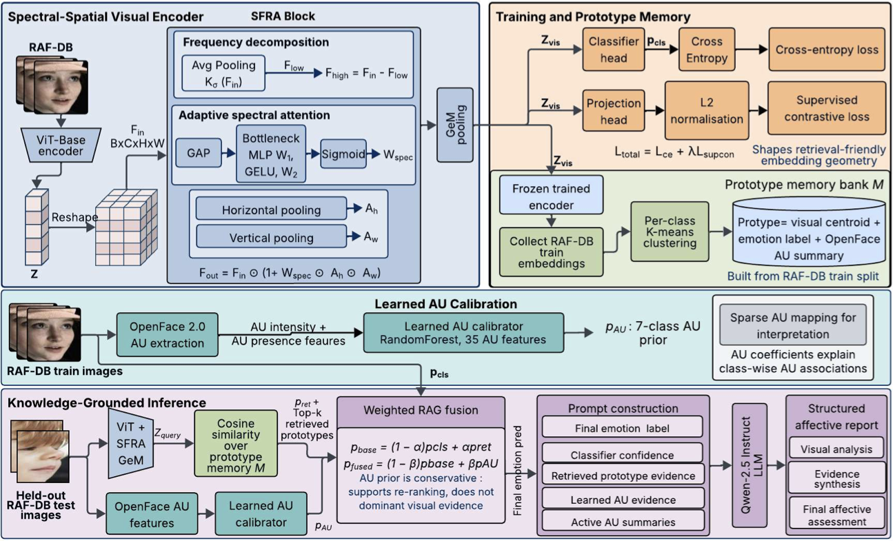

# SS-VLM

SS-VLM: A Spectral-Symbolic Vision-Language Framework for Auditable Facial Expression Recognition.

## Repository Role

This repository is the **latest updated implementation** of the SS-VLM project:

- Latest updated repository: https://github.com/rijju-das/SS-VLM
- Base/original repository: https://github.com/Moonquakeyu/Spectral-Symbolic-VLM

The base repository preserves the original concept-development path: RAF-DB dataset analysis, feature-manifold/t-SNE exploration, early notebooks, and hard-coded AU/FACS-prior prototypes. This repository contains the manuscript-aligned implementation, final v2 experiment scripts, learned-AU RAG fusion pipeline, and the audit and evaluation utilities used for the current paper.

## Project Story

SS-VLM reframes facial expression recognition from a black-box label prediction task into an auditable affective reasoning pipeline. The final implementation combines:

- **SFRA visual encoding** for localized high-frequency facial refinement.
- **Dual-head training** for classification and retrieval-friendly embeddings.
- **Prototype retrieval** over RAF-DB train-set centroids.
- **Learned AU calibration** from OpenFace 2.0 AU intensity/presence features.
- **Weighted RAG fusion** of classifier, retrieval, and AU-prior probabilities.
- **Constrained report generation** with evidence checks to reduce unsupported AU or clinical claims.

The latest manuscript results are based on the learned-AU v2 pipeline in this repository, not the older base-only or hard-coded-AU prototype pipeline.

## System Overview

[](Figure/architectureSSVLM.pdf)

The implementation follows the diagram above: SFRA visual encoding produces retrieval-friendly embeddings, a prototype memory bank provides train-set evidence, OpenFace 2 AU features are converted into a learned 7-class AU prior, and weighted RAG fusion combines classifier, retrieval, and AU evidence before structured report generation.

The system has four main stages:

1. **Spectral-spatial visual encoding**: a ViT-Base encoder is augmented with SFRA-style high-frequency refinement and GeM pooling to produce the visual embedding `z_vis`.
2. **Dual-head training and prototype memory**: classification uses cross-entropy, while a projection head with supervised contrastive loss shapes retrieval-friendly embedding geometry. A frozen trained encoder then builds a compact prototype memory bank from RAF-DB train embeddings.
3. **Learned AU calibration**: OpenFace 2 extracts full AU intensity/presence features; a learned RandomForest AU calibrator maps these features to a 7-class emotion prior `p_AU`.
4. **RAG fusion and report generation**: classifier probabilities, retrieved prototype evidence, and the learned AU prior are fused. The final prediction and evidence are passed to a constrained Qwen-2.5-Instruct report generator.

This README is the canonical implementation guide for the GitHub repository. The implementation, installation, OpenFace, learned-AU, RAG, output, and analysis details are kept here instead of separate documentation files.

## Current Pipeline

The final manuscript-aligned entry point is:

```bash
Pipeline/SS-VLM_Pipeline_v2.py
```

It supports:

```bash
python Pipeline/SS-VLM_Pipeline_v2.py --mode train
python Pipeline/SS-VLM_Pipeline_v2.py --mode rag
python Pipeline/SS-VLM_Pipeline_v2.py --mode full
```

Main experiment variants:

| Manuscript-facing name | Implementation value | Meaning |
| --- | --- |
| Plain ViT | `plain_vit` | Plain ViT classifier baseline |
| ViT+GeM | `vit_gem` | ViT baseline with GeM pooling |
| SS-VLM / SFRA-RAG | `sfra_v2` | Proposed manuscript configuration with SFRA + GeM visual encoding, prototype retrieval, learned-AU fusion, and structured reporting |

`Pipeline/SS-VLM_Pipeline.py` is retained as a shared dependency because the v2 pipeline imports constants/classes from it. Current experiments should be run with `Pipeline/SS-VLM_Pipeline_v2.py`.

## Installation

Clone and enter the latest implementation repository:

```bash
git clone https://github.com/rijju-das/SS-VLM.git
cd SS-VLM
```

Create the main SS-VLM environment:

```bash
conda env create -f environment-ssvlm.yml
conda activate ssvlm
```

If using pip inside an existing environment:

```bash
pip install torch torchvision --index-url https://download.pytorch.org/whl/cu121
pip install -r requirements.txt
```

Expected RAF-DB layout:

```text
RAF-DB/
  train/1/*.jpg
  train/2/*.jpg
  ...
  test/1/*.jpg
  test/2/*.jpg
  ...
```

Set the dataset root on the server when running commands:

```bash
export SSVLM_DATA_DIR=/home/rdas/RAF-DB
```

## OpenFace and Learned-AU Code Map

- `environment-openface2.yml`: no-sudo conda environment for building/running classic OpenFace 2.
- `tools/extract_openface2_aus.py`: RAF-DB extraction script for full OpenFace 2 AU intensity and presence outputs.
- `tools/extract_openface3_aus.py`: optional OpenFace 3 smoke-test extractor; OpenFace 3 emits only a partial AU subset.
- `tools/train_au_emotion_tabular.py`: learned RandomForest AU-to-emotion prior used during RAG fusion.
- `tools/learn_au_emotion_mapping.py`: sparse AU-emotion mapping for interpretation and figure generation.
- `rag_fusion_ssvlm_v2_learned_au_all_seeds.job`: final learned-AU RAG fusion job over the v2 model seeds.

## OpenFace 2 AU Extraction

The final learned-AU pipeline uses classic OpenFace 2 because it provides the full AU intensity/presence features needed for FACS-style evidence. OpenFace 3 is kept only as an optional smoke-test extractor because its CLI emits a smaller partial AU subset.

Create the OpenFace 2 environment:

```bash
export REPO=/home/rdas/SS-VLM

conda deactivate || true
conda install -n base -c conda-forge mamba -y
conda env create -f "$REPO/environment-openface2.yml"
conda activate openface2
```

Build OpenFace 2 under this repository:

```bash
mkdir -p "$REPO/tools"
cd "$REPO/tools"
git clone https://github.com/TadasBaltrusaitis/OpenFace.git OpenFace-2
cd OpenFace-2
git checkout OpenFace_2.2.0
bash ./download_models.sh

export CMAKE_PREFIX_PATH="$CONDA_PREFIX:$CMAKE_PREFIX_PATH"
export LD_LIBRARY_PATH="$CONDA_PREFIX/lib:$LD_LIBRARY_PATH"
export OpenBLAS_HOME="$CONDA_PREFIX"
export OpenCV_DIR="$CONDA_PREFIX/lib/cmake/opencv4"
export dlib_DIR="$CONDA_PREFIX/lib/cmake/dlib"

mkdir -p build
cd build

cmake -G Ninja \
  -D CMAKE_BUILD_TYPE=Release \
  -D CMAKE_PREFIX_PATH="$CONDA_PREFIX" \
  -D OpenCV_DIR="$CONDA_PREFIX/lib/cmake/opencv4" \
  -D dlib_DIR="$CONDA_PREFIX/lib/cmake/dlib" \
  -D dlib_INCLUDE_DIR="$CONDA_PREFIX/include" \
  -D dlib_INCLUDE_DIRS="$CONDA_PREFIX/include" \
  -D dlib_LIBRARY="$CONDA_PREFIX/lib/libdlib.so" \
  -D CMAKE_CXX_FLAGS="-pthread -I$CONDA_PREFIX/include" \
  -D CMAKE_EXE_LINKER_FLAGS="-pthread" \
  ..

cmake --build . --config Release -j "$(nproc)"
```

The CMake warning about `dlib_INCLUDE_DIR` and `dlib_LIBRARY` not being used is expected for this conda build path. Confirm that the binary exists:

```bash
ls -lh "$REPO/tools/OpenFace-2/build/bin/FeatureExtraction"
```

Run a one-image OpenFace 2 sanity check:

```bash
cd "$REPO/tools/OpenFace-2"
export LD_LIBRARY_PATH="$CONDA_PREFIX/lib:$LD_LIBRARY_PATH"

./build/bin/FeatureExtraction \
  -f /home/rdas/RAF-DB/train/1/train_00006_aligned.jpg \
  -out_dir "$REPO/outputs/openface2_direct_test" \
  -aus \
  -au_static \
  -q
```

Check that AU intensity columns were written:

```bash
head -1 "$REPO"/outputs/openface2_direct_test/*.csv | tr ',' '\n' | grep 'AU.*_r'
```

Run a 20-image smoke extraction:

```bash
cd "$REPO"
conda activate openface2
export LD_LIBRARY_PATH="$CONDA_PREFIX/lib:$LD_LIBRARY_PATH"

python tools/extract_openface2_aus.py \
  --data-root /home/rdas/RAF-DB \
  --output-csv "$REPO/outputs/rafdb_openface2_aus_smoke.csv" \
  --raw-dir "$REPO/outputs/openface2_raw_smoke" \
  --openface-bin "$REPO/tools/OpenFace-2/build/bin/FeatureExtraction" \
  --openface-cwd "$REPO/tools/OpenFace-2" \
  --max-images 20
```

Run the full RAF-DB OpenFace 2 extraction:

```bash
cd "$REPO"
conda activate openface2
export LD_LIBRARY_PATH="$CONDA_PREFIX/lib:$LD_LIBRARY_PATH"

python tools/extract_openface2_aus.py \
  --data-root /home/rdas/RAF-DB \
  --output-csv "$REPO/outputs/rafdb_openface2_aus.csv" \
  --raw-dir "$REPO/outputs/openface2_raw" \
  --openface-bin "$REPO/tools/OpenFace-2/build/bin/FeatureExtraction" \
  --openface-cwd "$REPO/tools/OpenFace-2"
```

The output CSV is:

```text
outputs/rafdb_openface2_aus.csv
```

The final learned-AU pipeline uses these OpenFace 2 AU intensity columns:

```text
AU01_r, AU02_r, AU04_r, AU05_r, AU06_r, AU07_r, AU09_r,
AU10_r, AU12_r, AU14_r, AU15_r, AU17_r, AU20_r, AU23_r,
AU25_r, AU26_r, AU45_r
```

OpenFace 2 also provides AU presence columns, and the selected learned AU calibrator uses intensity plus presence features.

Optional OpenFace 3 smoke test:

OpenFace 3 can run on CUDA, but its current CLI emits only a partial 8-AU subset. Use it only for smoke tests, not for the final full-AU experiments.

```bash
cd "$REPO"

python tools/extract_openface3_aus.py \
  --data-root /home/rdas/RAF-DB \
  --output-csv "$REPO/outputs/rafdb_openface3_aus.csv" \
  --raw-dir "$REPO/outputs/openface3_raw" \
  --openface-bin openface \
  --openface-cwd "$REPO/tools/OpenFace-3.0" \
  --device cuda \
  --cuda-visible-devices 0
```

## Learned AU Calibration

The base repository used a hand-coded FACS/AU prior. This updated repository replaces that with two learned AU components:

| Component | Script | Role |
| --- | --- | --- |
| Learned AU prior | `tools/train_au_emotion_tabular.py` | Trains the RandomForest AU-to-emotion model used in RAG fusion |
| Interpretable AU mapping | `tools/learn_au_emotion_mapping.py` | Learns sparse class-wise AU support for explanation and paper figures |

Train the selected RandomForest AU prior:

```bash
conda activate ssvlm

python tools/train_au_emotion_tabular.py \
  --au-csv outputs/rafdb_openface2_aus.csv \
  --output-dir outputs_v2/au_calibrator \
  --run-name au_both_rf_seed42 \
  --feature-set both \
  --model random_forest \
  --selection-metric accuracy \
  --n-estimators 1200 \
  --seed 42
```

Train the sparse AU-emotion mapping used for interpretation:

```bash
python tools/learn_au_emotion_mapping.py \
  --au-csv outputs/rafdb_openface2_aus.csv \
  --output-dir outputs_v2/au_mapping \
  --run-name learned_au_mapping_intensity_elasticnet \
  --feature-set intensity \
  --seeds 42,123,2026,7,99 \
  --permutation-repeats 10 \
  --top-k 6
```

Key learned-AU outputs:

```text
outputs_v2/au_calibrator/au_both_rf_seed42/au_emotion_tabular.joblib
outputs_v2/au_mapping/learned_au_mapping_intensity_elasticnet/
Figure/au_mapping_heatmap_learned.pdf
```

## Training and RAG Evaluation

Run the v2 seed sweeps:

```bash
sbatch baseline_v2_seed_sweep.job
sbatch ablation_ssvlm_v2_seed_sweep.job
```

Run final learned-AU RAG over all seeds:

```bash
sbatch rag_fusion_ssvlm_v2_learned_au_all_seeds.job
```

A direct single-run SS-VLM / SFRA-RAG learned-AU command:

```bash
python Pipeline/SS-VLM_Pipeline_v2.py \
  --mode rag \
  --data_dir /home/rdas/RAF-DB \
  --model_variant sfra_v2 \
  --model_path outputs_v2/models/seed_sweep/sfra_v2_l005_seed42.pth \
  --openface_au_csv outputs/rafdb_openface2_aus.csv \
  --au_model_path outputs_v2/au_calibrator/au_both_rf_seed42/au_emotion_tabular.joblib \
  --top_k 9 \
  --rag_fusion weighted \
  --rag_alpha 0.25 \
  --au_fusion_beta 0.05 \
  --retrieval_temperature 0.10 \
  --metrics_dir outputs_v2/metrics/rag_fusion_learned_au/beta005/sfra_v2_l005_seed42 \
  --skip_llm_reports
```

Fusion rule:

```text
p_base  = (1 - alpha) p_cls + alpha p_ret
p_fused = (1 - beta) p_base + beta p_AU
```

The manuscript setting is:

```text
alpha = 0.25
beta  = 0.05
top_k = 9
```

## Key Code

- `Pipeline/SS-VLM_Pipeline_v2.py`: final v2 training, retrieval, learned-AU RAG fusion, and reporting pipeline.
- `tools/extract_openface2_aus.py`: RAF-DB OpenFace 2.0 AU extraction.
- `tools/extract_openface3_aus.py`: optional OpenFace 3 smoke-test extraction.
- `tools/train_au_emotion_tabular.py`: learned RandomForest AU prior.
- `tools/learn_au_emotion_mapping.py`: sparse AU-emotion mapping for interpretation.
- `tools/analyze_v2_reliability.py`: per-class, correction-flow, and ECE summaries.
- `tools/evaluate_hallucination_metrics.py`: report-audit and faithfulness metrics.
- `tools/plot_*`: figure-generation utilities for confusion matrices, reliability, k-sensitivity, AU figures, Grad-CAM, and zero-shot VLM results.

## Manuscript-Aligned Results

Generated results are stored locally in the following locations and are intentionally excluded from version control:

- `outputs/rafdb_openface2_aus.csv`: OpenFace 2.0 AU features used by learned AU calibration.
- `outputs_v2/models/seed_sweep/`: final seed-sweep checkpoints for Plain ViT, ViT+GeM, and SS-VLM / SFRA-RAG.
- `outputs_v2/metrics/seed_sweep/`: classifier training histories and summaries.
- `outputs_v2/metrics/rag_fusion_learned_au/beta005/`: final learned-AU RAG predictions, reports, summaries, and k-sensitivity files.
- `outputs_v2/metrics/reliability_analysis_learned_au/`: manuscript-aligned correction-flow, per-class, McNemar, and ECE summaries.
- `outputs_v2/au_calibrator/au_both_rf_seed42/`: selected RandomForest AU prior artifacts.
- `outputs_v2/au_mapping/learned_au_mapping_intensity_elasticnet/`: sparse learned AU-emotion interpretation artifacts.
- `outputs/openface2_raw/`: raw per-image OpenFace 2 CSV outputs.
- `outputs_v2/figures/`: generated result figures.
- `outputs_vlm/zero_shot/`: zero-shot InstructBLIP/LLaVA RAF-DB outputs.
- `Figure/`: local copies of selected paper-ready result figures.

## Figure Generation and Analysis

Useful analysis scripts:

```text
tools/analyze_v2_reliability.py
tools/evaluate_hallucination_metrics.py
tools/plot_v2_reliability_diagram.py
tools/plot_best_rag_confusion_matrix.py
tools/plot_v2_au_rag_candidate_figures.py
tools/plot_v2_figure9_grounded_report.py
```

These scripts regenerate the reliability diagram, learned-AU mapping figure, confusion matrix, RAG evidence figures, and report-audit metrics used by the current manuscript.

## Reproduction Outline

1. Create the SS-VLM environment using `environment-ssvlm.yml` or `requirements.txt`.
2. Use `outputs/rafdb_openface2_aus.csv` directly, or regenerate it with the OpenFace 2 commands above.
3. Run v2 classifier/seed sweeps with `baseline_v2_seed_sweep.job` and `ablation_ssvlm_v2_seed_sweep.job`.
4. Train or inspect AU models using `tools/train_au_emotion_tabular.py` and `tools/learn_au_emotion_mapping.py`.
5. Run final learned-AU RAG evaluation with `rag_fusion_ssvlm_v2_learned_au_all_seeds.job`.
6. Regenerate reliability, correction-flow, report-audit, and figure outputs with the scripts in `tools/`.

## Final Manuscript Framing

The paper should cite both repositories:

- `Spectral-Symbolic-VLM` as the base/original project repository for concept development, RAF-DB topology analysis, and hard-coded AU/FACS prototype code.
- `SS-VLM` as the latest updated manuscript-aligned implementation containing the final learned-AU v2 code, current results, paper figures, and audit outputs.

This distinction keeps the development lineage transparent while making the final reproducible implementation easy to locate.
